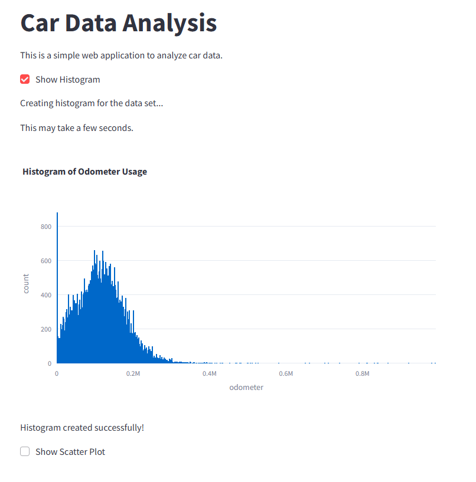

# 🚗 Car Data Visualization App (Streamlit)

## 📚 Description

This project is a web-based dashboard built with **Streamlit** and **Plotly Express** that allows users to explore a dataset of used car listings. It provides interactive histograms and scatter plots to analyze odometer readings and their relationship with other variables, helping identify patterns in vehicle usage.

---

## 🛠️ Technologies Used

- Python 
- Streamlit  
- Pandas  
- Plotly Express  
- Jupyter Notebook

---

## 🚀 How to Run

### 👉 Option 1: Run the app (Streamlit)

```bash
# Clone the repository
git clone https://github.com/andre-maccarini/car-data-visualization.git

# Navigate to the project folder
cd car-data-visualization

# Install dependencies
pip install -r requirements.txt

# Run the app
streamlit run app.py
```

## 👉 Option 2: Open the notebook for EDA
You can also explore the dataset and visualizations using the provided Jupyter Notebook:

notebooks/eda.ipynb

## 📁 Dataset
The data comes from a CSV file vehicles.csv located in the /Data/ folder. It contains used car listings with fields such as:

price, model_year, model, condition

cylinders, fuel, odometer, transmission

type, paint_color, is_4wd, days_listed

## 🎮 Preview



## 📊 Features

✅ Interactive checkbox to toggle histogram of odometer usage

✅ Interactive checkbox to toggle scatter plot

✅ Auto-resizing charts with Plotly Express

✅ Basic data exploration via notebook

## 🧠 What I Learned

How to build basic interactive dashboards with Streamlit

How to work with Plotly Express for visual exploration

How to link Python scripts to CSV data using relative paths

How to manage optional visualizations with conditionals in Streamlit

## 📈 Possible Improvements

 Add filters for model year, brand, or price range

 Add median/mean reference lines in plots

 Include more variables (e.g., price vs condition)

 Add download option for filtered data

## ✍️ Author
André Maccarini